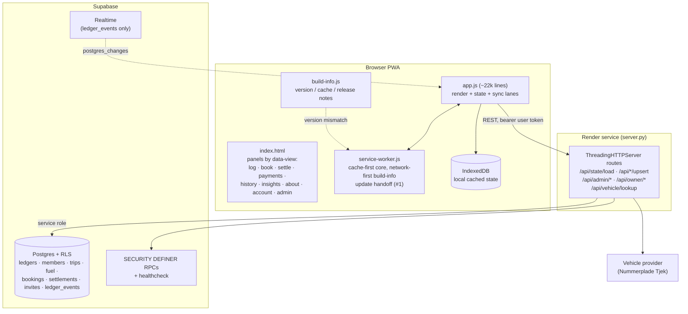
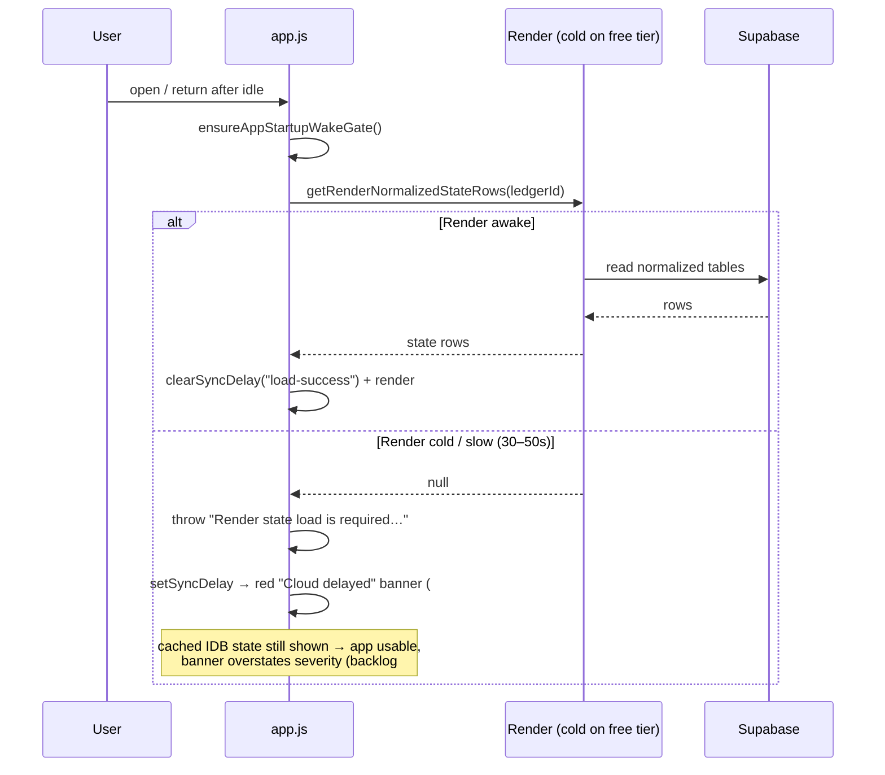

# Fuel Ledger — architecture & flow map

> Living overview of how the app is wired. **Maintenance rule:** whenever a task
> changes how parts connect (a route, a load/sync path, a panel, an auth step), update
> the relevant diagram/section here in the same PR. Haiku/Sonnet can do incremental
> edits; keep it accurate over pretty. Cross-reference open work in `LAUNCH-BACKLOG.md`.

## Component map

Key principle: **Render is the state authority.** The client reads/writes through the
Render API; Supabase is never hit directly from the browser for app state. IndexedDB +
a JSON mirror are local fallbacks.

## Load / sync lane (where most "feels unstable" bugs live)

Auth note: `onAuthStateChange` defers work to `handleAuthStateChange` via `setTimeout(0)`
to avoid the supabase-js auth-lock deadlock (the original "stuck after idle" root cause).

## Subsystems & where to look

| Area | Entry points | Open items |
|------|--------------|------------|
| Service-worker update handoff | `activateReadyAppUpdate`, build-update event | #1 (done, PR #19) |
| Cold-start banners | `loadSupabaseState`, `renderSyncHealthBanner`, startup gate | #3 |
| Predictions / fuel intelligence | `buildSmartPredictions`, `buildFuelIntelligence`, `calculateHistoricalFuelStats` | #4 |
| Onboarding / invites | `renderWorkspaceInvitesPanel`, server invite RPCs | #5, #10 |
| Admin role separation | `canUseGlobalAdminTools`, `#dataToolsPanel` | #6, #8 |
| Admin observability (tiles/tools/health) | `renderAdminGuardrailOverview`, `renderSupabaseLoadMonitor`, `renderSystemHealth`, `build_render_admin_health` | #11, #13, #14, #15, #16 |
| Layout "go wide" | `.settings-form`, `.workspace-invites-grid`, `.admin-diagnostics-*` | #7, #10, #14 |
| Booking | `#bookingForm`, calendar card | #17 |

> See `LAUNCH-BACKLOG.md` for the full task list, categories, and the
> "Admin observability" design principle.
